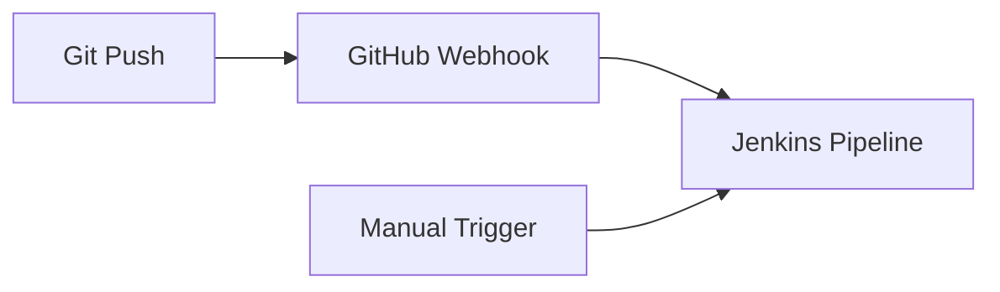
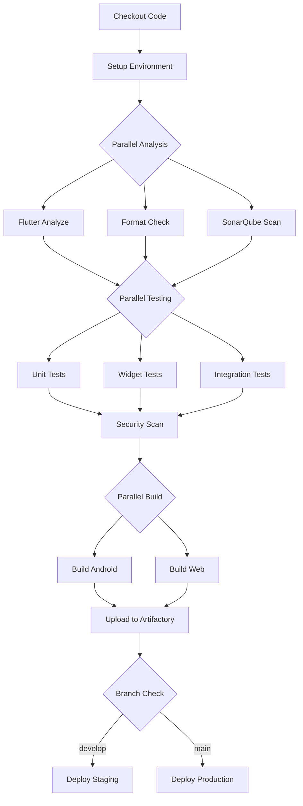

# Documentación Detallada de Implementación CI/CD - OWASP Note

Este documento proporciona una explicación exhaustiva de todos los componentes del pipeline CI/CD implementado para el proyecto OWASP Note.

## 📋 Tabla de Contenidos

1. [Visión General](#visión-general)
2. [Jenkinsfile - Pipeline Principal](#jenkinsfile---pipeline-principal)
3. [Configuración de SonarQube](#configuración-de-sonarqube)
4. [Scripts de Build](#scripts-de-build)
5. [Integración con Artifactory](#integración-con-artifactory)
6. [Infraestructura Docker](#infraestructura-docker)
7. [Flujo de Trabajo Completo](#flujo-de-trabajo-completo)

---

## 🎯 Visión General

La implementación CI/CD consta de los siguientes componentes principales:

```
owaspnote/
├── Jenkinsfile                    # Pipeline principal
├── sonar-project.properties       # Configuración de análisis de código
├── ci/
│   ├── Dockerfile                # Imagen personalizada para CI
│   ├── docker-compose.yml        # Stack completo de servicios
│   ├── nginx.conf               # Reverse proxy y SSL
│   └── scripts/
│       ├── build_android.sh     # Build automatizado Android
│       ├── build_web.sh         # Build automatizado Web
│       └── artifactory_upload.sh # Gestión de artefactos
└── README_CICD.md               # Guía de uso
```

---

## 📄 Jenkinsfile - Pipeline Principal

### Ubicación: `/Jenkinsfile`

### Propósito:
Define el pipeline completo de CI/CD utilizando sintaxis declarativa de Jenkins.

### Estructura y Funcionalidades:

#### 1. **Configuración del Agente**
```groovy
agent {
    docker {
        image 'ghcr.io/cirruslabs/flutter:stable'
        args '-v /var/run/docker.sock:/var/run/docker.sock'
    }
}
```
- Utiliza imagen Docker oficial de Flutter
- Monta el socket de Docker para permitir builds dentro de contenedores

#### 2. **Variables de Entorno**
```groovy
environment {
    ARTIFACTORY_URL = credentials('artifactory-url')
    SONAR_HOST_URL = credentials('sonarqube-url')
    // ... más credenciales
}
```
- Gestión segura de credenciales
- Variables para URLs de servicios
- Tokens de autenticación
- Configuración de firma de apps

#### 3. **Etapas del Pipeline**

##### a) **Checkout**
```groovy
stage('Checkout') {
    steps {
        checkout scm
        script {
            env.GIT_COMMIT_MSG = sh(...)
            env.GIT_AUTHOR = sh(...)
        }
    }
}
```
- Clona el código fuente
- Captura información del commit para trazabilidad

##### b) **Environment Setup**
```groovy
stage('Environment Setup') {
    steps {
        sh '''
            flutter --version
            flutter doctor -v
        '''
    }
}
```
- Verifica la instalación de Flutter
- Crea archivos de configuración necesarios

##### c) **Code Quality (Paralelo)**
```groovy
stage('Code Quality') {
    parallel {
        stage('Flutter Analyze') { ... }
        stage('Format Check') { ... }
        stage('SonarQube Analysis') { ... }
    }
}
```
- **Flutter Analyze**: Análisis estático del código Dart
- **Format Check**: Verifica el formato del código
- **SonarQube**: Análisis profundo de calidad y seguridad

##### d) **Testing (Paralelo)**
```groovy
stage('Testing') {
    parallel {
        stage('Unit Tests') { ... }
        stage('Widget Tests') { ... }
        stage('Integration Tests') { ... }
    }
}
```
- Ejecuta todos los tipos de tests
- Genera reportes de cobertura
- Tests de integración solo en ramas principales

##### e) **Security Scan**
```groovy
stage('Security Scan') {
    steps {
        sh '''
            # Busca secretos hardcodeados
            grep -r "password\\|secret\\|api_key" lib/
            # Verifica uso de HTTP inseguro
            grep -r "http://" lib/
        '''
    }
}
```
- Escaneo de vulnerabilidades
- Detección de secretos en código
- Verificación de conexiones seguras

##### f) **Build (Paralelo)**
```groovy
stage('Build') {
    parallel {
        stage('Build Android') { ... }
        stage('Build Web') { ... }
    }
}
```
- Build simultáneo para múltiples plataformas
- Genera APK, AAB y paquetes web
- Aplica ofuscación y optimizaciones

##### g) **Upload to Artifactory**
```groovy
stage('Upload to Artifactory') {
    when {
        branch pattern: "(main|develop|release/.*)"
    }
    steps { ... }
}
```
- Sube artefactos solo de ramas importantes
- Organiza artefactos por versión
- Genera metadatos de build

##### h) **Deploy Stages**
```groovy
stage('Deploy to Staging') {
    when { branch 'develop' }
    // ...
}

stage('Deploy to Production') {
    when { branch 'main' }
    input { message "Deploy to production?" }
    // ...
}
```
- Despliegue automático a staging
- Despliegue manual a producción con aprobación
- Soporte para Firebase App Distribution

#### 4. **Post Actions**
```groovy
post {
    always {
        cleanWs()
        // Notificaciones
    }
    success { ... }
    failure { ... }
}
```
- Limpieza del workspace
- Notificaciones de estado
- Manejo de fallos

### Uso:
- Se ejecuta automáticamente con cada push
- Puede ejecutarse manualmente desde Jenkins
- Soporta webhooks de GitHub

---

## 🔍 Configuración de SonarQube

### Ubicación: `/sonar-project.properties`

### Propósito:
Configura el análisis de calidad de código y seguridad con SonarQube.

### Configuraciones Clave:

#### 1. **Identificación del Proyecto**
```properties
sonar.projectKey=owaspnote
sonar.projectName=OWASP Note - Secure Note Taking App
sonar.projectVersion=1.0
```

#### 2. **Configuración de Fuentes**
```properties
sonar.sources=lib
sonar.tests=test,integration_test
sonar.exclusions=**/*.g.dart,**/*.freezed.dart
```
- Define qué analizar
- Excluye archivos generados
- Separa código de producción y tests

#### 3. **Cobertura de Código**
```properties
sonar.dart.coverage.reportPath=coverage/lcov.info
sonar.coverage.exclusions=**/*_test.dart
```
- Integra reportes de cobertura
- Excluye archivos de test del cálculo

#### 4. **Reglas de Seguridad OWASP**
```properties
sonar.owasp.activateRules=true
sonar.owasp.top10.2021=true
sonar.security.hotspots.review.required=true
```
- Activa reglas OWASP Top 10
- Requiere revisión de hotspots de seguridad

#### 5. **Reglas Específicas de Flutter**
```properties
sonar.dart.analyzer.rules.avoid_print=true
sonar.dart.analyzer.rules.prefer_const_constructors=true
sonar.mobile.secure_storage.check=true
sonar.mobile.certificate_pinning.check=true
```
- Reglas de estilo de código
- Verificaciones de seguridad móvil

### Uso:
- Ejecutado automáticamente en el pipeline
- Puede ejecutarse localmente: `sonar-scanner`
- Los resultados se visualizan en SonarQube UI

---

## 🔨 Scripts de Build

### 1. Build Android Script

#### Ubicación: `/ci/scripts/build_android.sh`

#### Propósito:
Automatiza la construcción de la aplicación Android con mejores prácticas de seguridad.

#### Funcionalidades Principales:

##### a) **Verificaciones de Seguridad**
```bash
# Check for hardcoded secrets
if grep -r "password\|secret\|api_key" lib/; then
    print_warning "Potential hardcoded secrets found"
fi
```
- Escanea código en busca de secretos
- Verifica uso de HTTPS

##### b) **Proceso de Build**
```bash
flutter build apk --release \
    --obfuscate \
    --split-debug-info=build/debug-info \
    --tree-shake-icons
```
- **--obfuscate**: Ofusca el código Dart
- **--split-debug-info**: Separa símbolos de debug
- **--tree-shake-icons**: Elimina iconos no usados

##### c) **Generación de Checksums**
```bash
sha256sum owaspnote-$VERSION.apk > owaspnote-$VERSION.apk.sha256
```
- Crea hashes SHA-256 para verificación de integridad

##### d) **Análisis del APK**
```bash
# Extrae y analiza contenido del APK
unzip -q "$APK_FILE" -d "$TEMP_DIR"
# Verifica información de debug en releases
grep -r "BuildConfig.DEBUG" "$TEMP_DIR"
```

##### e) **Reporte de Build**
```bash
cat > $OUTPUT_DIR/build-report.txt << EOF
Security Features:
- Code obfuscation: Enabled
- Certificate pinning: Enabled
- Anti-tampering: Enabled
EOF
```

### 2. Build Web Script

#### Ubicación: `/ci/scripts/build_web.sh`

#### Propósito:
Construye la aplicación web con optimizaciones y configuraciones de seguridad.

#### Funcionalidades Principales:

##### a) **Build Optimizado**
```bash
flutter build web --release \
    --web-renderer=canvaskit \
    --pwa-strategy=offline-first \
    --csp
```
- **canvaskit**: Renderizado de alta calidad
- **offline-first**: Estrategia PWA para offline
- **--csp**: Habilita Content Security Policy

##### b) **Optimización de Assets**
```bash
# Comprime archivos JavaScript
find build/web -name "*.js" -type f -exec gzip -9 -k {} \;
```

##### c) **Headers de Seguridad**
```bash
cat > build/web/_headers << EOF
X-Frame-Options: DENY
X-Content-Type-Options: nosniff
Content-Security-Policy: default-src 'self'...
EOF
```
- Protección contra clickjacking
- Prevención de MIME sniffing
- Política de seguridad de contenido

##### d) **Empaquetado**
```bash
tar -czf owaspnote-web-$VERSION.tar.gz *
zip -r owaspnote-web-$VERSION.zip *
```

##### e) **Instrucciones de Despliegue**
Genera configuraciones para:
- Nginx
- Apache
- Headers de seguridad
- Configuración SSL

### 3. Artifactory Upload Script

#### Ubicación: `/ci/scripts/artifactory_upload.sh`

#### Propósito:
Gestiona la subida de artefactos a JFrog Artifactory con metadatos.

#### Funcionalidades Principales:

##### a) **Configuración de JFrog CLI**
```bash
jfrog config add artifactory-server \
    --artifactory-url="$ARTIFACTORY_URL" \
    --user="$ARTIFACTORY_USER" \
    --password="$ARTIFACTORY_PASSWORD"
```

##### b) **Upload con Metadatos**
```bash
jfrog rt upload "$file_path" "$target_path" \
    --props="build.number=$BUILD_NUMBER;version=$VERSION;sha256=$file_sha256"
```
- Añade propiedades a cada artefacto
- Incluye checksums y metadata

##### c) **Estructura de Repositorio**
```bash
REPO_BASE/
├── android/
│   └── 1.0.0/
│       ├── owaspnote-1.0.0-1.apk
│       └── owaspnote-1.0.0-1.aab
└── web/
    └── 1.0.0/
        └── owaspnote-web-1.0.0-1.tar.gz
```

##### d) **Build Metadata JSON**
```json
{
  "build": {
    "number": "123",
    "version": "1.0.0",
    "security_features": {
      "code_obfuscation": true,
      "certificate_pinning": true
    }
  }
}
```

##### e) **Limpieza Automática**
```bash
# Mantiene solo los últimos 10 builds
jfrog rt search "$REPO_BASE/*" --sort-by="created" | \
    tail -n +50 | while read -r old_artifact; do
    jfrog rt delete "$old_artifact"
done
```

---

## 🐳 Infraestructura Docker

### 1. Dockerfile CI

#### Ubicación: `/ci/Dockerfile`

#### Propósito:
Crea una imagen Docker personalizada con todas las herramientas necesarias para CI/CD.

#### Componentes Instalados:

##### a) **Base y Herramientas**
```dockerfile
FROM ghcr.io/cirruslabs/flutter:stable

RUN apt-get install -y \
    curl git unzip wget jq \
    python3 python3-pip \
    nodejs npm docker.io
```

##### b) **Herramientas CI/CD**
```dockerfile
# Firebase CLI
RUN npm install -g firebase-tools

# Fastlane para deployment móvil
RUN gem install fastlane -NV

# SonarScanner
RUN wget sonar-scanner-cli-4.8.0.zip

# JFrog CLI
RUN curl -fL https://getcli.jfrog.io | sh
```

##### c) **Configuración de Seguridad**
```dockerfile
# Usuario no-root
RUN useradd -m -s /bin/bash flutter
USER flutter

# Health check
HEALTHCHECK --interval=30s CMD flutter doctor
```

### 2. Docker Compose

#### Ubicación: `/ci/docker-compose.yml`

#### Propósito:
Orquesta todos los servicios del stack CI/CD.

#### Servicios Definidos:

##### a) **Jenkins**
```yaml
jenkins:
  image: jenkins/jenkins:lts
  ports:
    - "8080:8080"
  volumes:
    - jenkins_home:/var/jenkins_home
    - /var/run/docker.sock:/var/run/docker.sock
```
- Servidor CI principal
- Acceso a Docker para builds
- Persistencia de datos

##### b) **SonarQube + PostgreSQL**
```yaml
sonarqube:
  image: sonarqube:9-community
  depends_on:
    - postgres
  environment:
    - SONAR_ES_BOOTSTRAP_CHECKS_DISABLE=true
```
- Análisis de calidad de código
- Base de datos PostgreSQL dedicada

##### c) **JFrog Artifactory**
```yaml
artifactory:
  image: releases-docker.jfrog.io/jfrog/artifactory-oss:latest
  ports:
    - "8081:8081"
  volumes:
    - artifactory_data:/var/opt/jfrog/artifactory
```
- Gestión de artefactos
- Almacenamiento persistente

##### d) **Flutter CI Agent**
```yaml
flutter-ci:
  build:
    context: .
    dockerfile: Dockerfile
  volumes:
    - ../:/workspace
```
- Agente de build dedicado
- Caché de dependencias

##### e) **Nginx Reverse Proxy**
```yaml
nginx:
  image: nginx:alpine
  ports:
    - "80:80"
    - "443:443"
```
- Punto de entrada único
- Terminación SSL
- Routing a servicios

### 3. Nginx Configuration

#### Ubicación: `/ci/nginx.conf`

#### Propósito:
Configura el reverse proxy con SSL y seguridad.

#### Características:

##### a) **Configuración SSL**
```nginx
ssl_protocols TLSv1.2 TLSv1.3;
ssl_ciphers HIGH:!aNULL:!MD5;
ssl_session_cache shared:SSL:10m;
```

##### b) **Headers de Seguridad**
```nginx
add_header X-Frame-Options "SAMEORIGIN" always;
add_header X-Content-Type-Options "nosniff" always;
add_header X-XSS-Protection "1; mode=block" always;
```

##### c) **Routing de Servicios**
```nginx
location /jenkins/ {
    proxy_pass http://jenkins:8080/jenkins/;
    proxy_http_version 1.1;
    proxy_set_header Upgrade $http_upgrade;
}

location /sonarqube/ {
    proxy_pass http://sonarqube:9000/;
}

location /artifactory/ {
    proxy_pass http://artifactory:8082/artifactory/;
    client_max_body_size 1G;
}
```

---

## 🔄 Flujo de Trabajo Completo

### 1. **Trigger del Pipeline**



### 2. **Proceso de Build**



### 3. **Gestión de Artefactos**

```
BUILD -> PACKAGE -> SIGN -> UPLOAD -> STORE -> DEPLOY
  │         │         │        │         │        │
  └─────────┴─────────┴────────┴─────────┴────────┘
                    Trazabilidad Completa
```

### 4. **Monitoreo y Feedback**

- **Jenkins**: Estado del build y logs
- **SonarQube**: Métricas de calidad y seguridad
- **Artifactory**: Inventario de artefactos
- **Notificaciones**: Email/Slack en caso de fallo

---

## 🔐 Consideraciones de Seguridad

### 1. **Gestión de Secretos**
- Todos los secretos en Jenkins Credentials Store
- No se almacenan en código
- Rotación periódica recomendada

### 2. **Seguridad del Pipeline**
- Builds en contenedores aislados
- Sin acceso directo a sistemas de producción
- Aprobación manual para producción

### 3. **Seguridad de Artefactos**
- Firma digital de artefactos
- Checksums SHA-256
- Escaneo de vulnerabilidades

### 4. **Seguridad de Red**
- Todo el tráfico sobre HTTPS
- Certificados SSL/TLS
- Headers de seguridad configurados

---

## 📊 Métricas y KPIs

El pipeline genera las siguientes métricas:

1. **Tiempo de Build**: Duración total del pipeline
2. **Tasa de Éxito**: % de builds exitosos
3. **Cobertura de Código**: % de código cubierto por tests
4. **Deuda Técnica**: Medida por SonarQube
5. **Vulnerabilidades**: Detectadas por análisis de seguridad
6. **Tiempo de Despliegue**: Desde commit hasta producción

---

## 🚀 Uso y Mantenimiento

### Iniciar el Stack:
```bash
cd ci
docker-compose up -d
```

### Verificar Estado:
```bash
docker-compose ps
docker-compose logs -f [servicio]
```

### Actualizar Herramientas:
```bash
docker-compose pull
docker-compose up -d
```

### Backup:
```bash
# Script de backup incluido en README_CICD.md
./backup-cicd.sh
```

---

**Última actualización**: $(date)  
**Versión**: 1.0.0  
**Mantenido por**: OWASP Note DevOps Team