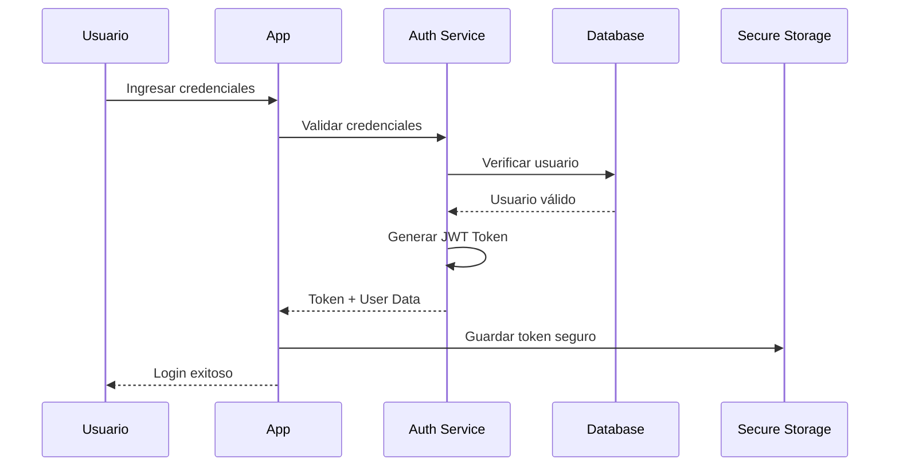
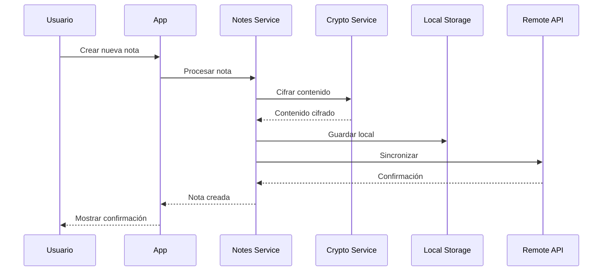
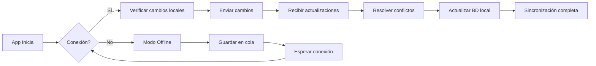

# High Level Design (HLD) - OWASP Note

## 1. Introducción

### 1.1 Propósito del Documento
Este documento describe el diseño de alto nivel de OWASP Note, una aplicación móvil y web segura para la gestión de notas que implementa las mejores prácticas de seguridad de OWASP.

### 1.2 Alcance
El documento cubre la arquitectura general del sistema, componentes principales, flujos de datos, decisiones de diseño y consideraciones de seguridad a nivel macro.

### 1.3 Audiencia Objetivo
- Arquitectos de Software
- Desarrolladores Senior
- DevOps Engineers
- Security Engineers
- Stakeholders del Proyecto

## 2. Visión General del Sistema

### 2.1 Descripción del Sistema
OWASP Note es una aplicación de gestión de notas segura que permite a los usuarios crear, editar, y gestionar notas de forma segura en múltiples plataformas (Android, iOS, Web).

### 2.2 Objetivos del Sistema
- **Seguridad**: Implementar las mejores prácticas de seguridad OWASP
- **Multiplataforma**: Soporte para Android, iOS y Web
- **Rendimiento**: Respuesta rápida y experiencia fluida
- **Escalabilidad**: Capacidad de crecer con la base de usuarios
- **Disponibilidad**: 99.9% de uptime

### 2.3 Características Principales
- Autenticación segura con biometría
- Cifrado de datos end-to-end
- Sincronización entre dispositivos
- Modo offline
- Anti-tampering y detección de root/jailbreak

## 3. Arquitectura del Sistema

### 3.1 Diagrama de Arquitectura General

```
┌─────────────────────────────────────────────────────────────────────┐
│                           Capa de Presentación                       │
├─────────────────┬─────────────────┬─────────────────────────────────┤
│   Android App   │    iOS App      │         Web App                 │
│   (Flutter)     │   (Flutter)     │        (Flutter)                │
└────────┬────────┴────────┬────────┴────────┬────────────────────────┘
         │                 │                 │
         └─────────────────┴─────────────────┘
                           │
                    ┌──────▼──────┐
                    │   Flutter    │
                    │  Framework   │
                    └──────┬──────┘
                           │
┌──────────────────────────▼──────────────────────────────────────────┐
│                        Capa de Lógica de Negocio                     │
├──────────────┬──────────────┬──────────────┬───────────────────────┤
│   Auth       │    Notes     │   Security   │     Sync              │
│  Service     │   Service    │   Service    │    Service            │
└──────┬───────┴──────┬───────┴──────┬───────┴───────┬───────────────┘
       │              │              │               │
┌──────▼──────────────▼──────────────▼───────────────▼───────────────┐
│                         Capa de Datos                                │
├─────────────────┬─────────────────┬─────────────────────────────────┤
│  Local Storage  │  Secure Storage │    Remote API                   │
│   (SQLite)      │  (Encrypted)    │    (REST/GraphQL)               │
└─────────────────┴─────────────────┴─────────────────────────────────┘
                                            │
                                     ┌──────▼──────┐
                                     │   Backend   │
                                     │   Services  │
                                     └─────────────┘
```

### 3.2 Componentes Principales

#### 3.2.1 Capa de Presentación
- **Flutter Apps**: Aplicaciones nativas para Android, iOS y Web
- **UI Components**: Widgets reutilizables siguiendo Material Design
- **State Management**: Gestión de estado con Provider/Riverpod

#### 3.2.2 Capa de Lógica de Negocio
- **Authentication Service**: Gestión de login, registro, sesiones
- **Notes Service**: CRUD de notas, búsqueda, categorización
- **Security Service**: Cifrado, validación, protección
- **Sync Service**: Sincronización entre dispositivos

#### 3.2.3 Capa de Datos
- **Local Storage**: Base de datos SQLite para datos offline
- **Secure Storage**: Almacenamiento cifrado para datos sensibles
- **Remote API**: Comunicación con servicios backend

### 3.3 Arquitectura de Despliegue

```
┌─────────────────┐     ┌─────────────────┐     ┌─────────────────┐
│   Mobile Apps   │     │    Web App      │     │   Admin Panel   │
│  (Android/iOS)  │     │   (Flutter)     │     │   (Flutter)     │
└────────┬────────┘     └────────┬────────┘     └────────┬────────┘
         │                       │                       │
         └───────────────────────┴───────────────────────┘
                                │
                         ┌──────▼──────┐
                         │  CloudFlare │
                         │     CDN      │
                         └──────┬──────┘
                                │
                         ┌──────▼──────┐
                         │ Load Balancer│
                         │  (AWS ALB)   │
                         └──────┬──────┘
                                │
                    ┌───────────┴───────────┐
                    │                       │
              ┌─────▼─────┐           ┌─────▼─────┐
              │  API       │           │  API      │
              │ Gateway 1  │           │ Gateway 2 │
              └─────┬─────┘           └─────┬─────┘
                    │                       │
        ┌───────────┴───────────────────────┴───────────┐
        │                                               │
   ┌────▼────┐  ┌────────┐  ┌──────────┐  ┌───────────┐
   │  Auth   │  │ Notes  │  │ Storage  │  │  Sync     │
   │ Service │  │Service │  │ Service  │  │ Service   │
   └────┬────┘  └────┬───┘  └────┬─────┘  └─────┬─────┘
        │            │            │              │
        └────────────┴────────────┴──────────────┘
                            │
                    ┌───────▼────────┐
                    │   PostgreSQL   │
                    │    Cluster     │
                    └────────────────┘
```

## 4. Flujos de Datos Principales

### 4.1 Flujo de Autenticación



### 4.2 Flujo de Creación de Nota



### 4.3 Flujo de Sincronización



## 5. Modelo de Datos de Alto Nivel

### 5.1 Entidades Principales

```
┌─────────────┐     ┌─────────────┐     ┌─────────────┐
│    User     │     │    Note     │     │  Category   │
├─────────────┤     ├─────────────┤     ├─────────────┤
│ id          │     │ id          │     │ id          │
│ email       │     │ title       │     │ name        │
│ password    │     │ content     │     │ color       │
│ biometric   │     │ created_at  │     │ icon        │
│ settings    │     │ updated_at  │     │ user_id     │
└──────┬──────┘     │ user_id     │     └─────────────┘
       │            │ category_id │            ▲
       │            │ encrypted   │            │
       │            └──────┬──────┘            │
       │                   │                   │
       └───────────────────┴───────────────────┘
```

### 5.2 Relaciones
- Un Usuario puede tener múltiples Notas
- Una Nota pertenece a un Usuario
- Una Nota puede tener una Categoría
- Un Usuario puede tener múltiples Categorías

## 6. Decisiones de Diseño

### 6.1 Tecnologías Seleccionadas

| Componente | Tecnología | Justificación |
|------------|------------|---------------|
| Frontend | Flutter | Desarrollo multiplataforma unificado |
| State Management | Riverpod | Mejor rendimiento y type safety |
| Local DB | SQLite | Ligero y confiable para móvil |
| Cifrado | AES-256-GCM | Estándar de la industria |
| Backend | Node.js/Go | Alto rendimiento y escalabilidad |
| Base de Datos | PostgreSQL | ACID compliance y robustez |
| Cache | Redis | Baja latencia para sesiones |
| CDN | CloudFlare | Protección DDoS y rendimiento |

### 6.2 Patrones de Diseño

- **Repository Pattern**: Abstracción de acceso a datos
- **Service Layer**: Lógica de negocio centralizada
- **Factory Pattern**: Creación de objetos complejos
- **Observer Pattern**: Notificaciones de cambios
- **Singleton**: Servicios únicos (Auth, Config)

### 6.3 Principios de Diseño

- **SOLID Principles**: Código mantenible y extensible
- **DRY**: No repetir código
- **KISS**: Mantener simplicidad
- **Security by Design**: Seguridad desde el inicio
- **Mobile First**: Optimización para móviles

## 7. Consideraciones de Seguridad

### 7.1 Arquitectura de Seguridad

```
┌─────────────────────────────────────────────────────────┐
│                   Capa de Seguridad                      │
├──────────────┬──────────────┬──────────────┬───────────┤
│   WAF        │   DDoS       │   Rate       │   IDS/    │
│ (CloudFlare) │ Protection   │  Limiting    │   IPS     │
└──────┬───────┴──────┬───────┴──────┬───────┴─────┬─────┘
       │              │              │             │
┌──────▼──────────────▼──────────────▼─────────────▼─────┐
│                  API Gateway Security                   │
├──────────────┬──────────────┬──────────────────────────┤
│   OAuth 2.0  │     JWT      │   API Key Management    │
└──────┬───────┴──────┬───────┴──────────────────────────┘
       │              │
┌──────▼──────────────▼───────────────────────────────────┐
│                Application Security                      │
├──────────────┬──────────────┬──────────────┬───────────┤
│  Input       │   Output     │   Session    │   Data    │
│ Validation   │   Encoding   │ Management   │ Encryption│
└──────────────┴──────────────┴──────────────┴───────────┘
```

### 7.2 Controles de Seguridad

1. **Autenticación y Autorización**
   - Multi-factor authentication (MFA)
   - Biometric authentication
   - JWT con rotación de tokens
   - RBAC (Role-Based Access Control)

2. **Protección de Datos**
   - Cifrado en reposo (AES-256)
   - Cifrado en tránsito (TLS 1.3)
   - Key management seguro
   - Data masking para logs

3. **Seguridad de Aplicación**
   - Certificate pinning
   - Anti-tampering
   - Root/Jailbreak detection
   - Code obfuscation

4. **Seguridad de Red**
   - WAF (Web Application Firewall)
   - DDoS protection
   - Rate limiting
   - IP whitelisting para admin

## 8. Consideraciones de Rendimiento

### 8.1 Objetivos de Rendimiento
- Tiempo de respuesta API: < 200ms (p95)
- Tiempo de carga inicial: < 3s
- FPS en animaciones: 60fps
- Uso de memoria: < 150MB móvil
- Tamaño de APK: < 25MB

### 8.2 Estrategias de Optimización
- Lazy loading de componentes
- Caching agresivo (Redis)
- CDN para assets estáticos
- Compresión de imágenes
- Code splitting para web
- Database indexing optimizado

## 9. Escalabilidad

### 9.1 Escalabilidad Horizontal

```
                    ┌─────────────┐
                    │Load Balancer│
                    └──────┬──────┘
                           │
        ┌──────────────────┼──────────────────┐
        │                  │                  │
   ┌────▼────┐       ┌────▼────┐       ┌────▼────┐
   │  Node 1 │       │  Node 2 │       │  Node N │
   └─────────┘       └─────────┘       └─────────┘
```

### 9.2 Estrategias de Escalado
- Auto-scaling basado en CPU/memoria
- Microservicios para componentes críticos
- Read replicas para base de datos
- Sharding para datos de usuarios
- Event-driven architecture
- Message queuing (RabbitMQ/Kafka)

## 10. Monitoreo y Observabilidad

### 10.1 Stack de Monitoreo

```
┌─────────────┬─────────────┬─────────────┬─────────────┐
│   Metrics   │    Logs     │   Traces    │   Alerts    │
├─────────────┼─────────────┼─────────────┼─────────────┤
│ Prometheus  │     ELK     │   Jaeger    │  PagerDuty  │
│  Grafana    │    Stack    │   Zipkin    │    Slack    │
└─────────────┴─────────────┴─────────────┴─────────────┘
```

### 10.2 KPIs Principales
- Disponibilidad del servicio
- Latencia de API
- Tasa de error
- Uso de recursos
- Métricas de seguridad
- User experience metrics

## 11. Disaster Recovery

### 11.1 Estrategia de Backup
- Backups automáticos cada 6 horas
- Retención de 30 días
- Replicación geográfica
- Point-in-time recovery
- Pruebas de restauración mensuales

### 11.2 RTO y RPO
- RTO (Recovery Time Objective): 4 horas
- RPO (Recovery Point Objective): 1 hora
- Failover automático
- Runbooks documentados

## 12. Compliance y Regulaciones

### 12.1 Standards de Seguridad
- OWASP Top 10
- OWASP Mobile Top 10
- ISO 27001
- SOC 2 Type II

### 12.2 Regulaciones
- GDPR (Europa)
- CCPA (California)
- LGPD (Brasil)
- Data residency requirements

## 13. Roadmap Técnico

### Fase 1 (Q1 2024)
- MVP con funcionalidades básicas
- Autenticación segura
- CRUD de notas
- Cifrado básico

### Fase 2 (Q2 2024)
- Sincronización multi-dispositivo
- Categorías y etiquetas
- Búsqueda avanzada
- Modo offline completo

### Fase 3 (Q3 2024)
- Compartir notas seguro
- Colaboración en tiempo real
- Versionado de notas
- API pública

### Fase 4 (Q4 2024)
- IA para organización
- Voice notes
- Integración con terceros
- Enterprise features

## 14. Conclusión

Este HLD proporciona una visión integral de la arquitectura de OWASP Note, estableciendo las bases para un sistema seguro, escalable y mantenible. El diseño prioriza la seguridad sin comprometer la experiencia del usuario, siguiendo las mejores prácticas de la industria y los estándares de OWASP.

---

**Documento**: High Level Design v1.0  
**Fecha**: Julio 2024  
**Estado**: Aprobado  
**Próxima Revisión**: Enero 2025