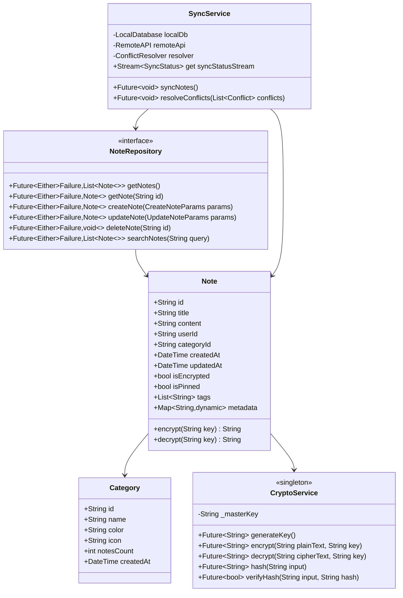

# Low Level Design (LLD) - OWASP Note

## 1. Introducción

### 1.1 Propósito del Documento
Este documento detalla el diseño de bajo nivel de OWASP Note, proporcionando especificaciones técnicas detalladas, estructuras de datos, algoritmos, y detalles de implementación específicos.

### 1.2 Relación con HLD
Este LLD implementa y detalla los componentes definidos en el High Level Design, proporcionando el nivel de detalle necesario para la implementación.

### 1.3 Audiencia Objetivo
- Desarrolladores
- Technical Leads
- QA Engineers
- DevOps Engineers

## 2. Arquitectura de Componentes Detallada

### 2.1 Estructura del Proyecto Flutter

```
owaspnote/
├── lib/
│   ├── main.dart                 # Entry point
│   ├── app.dart                  # App configuration
│   ├── core/
│   │   ├── constants/
│   │   │   ├── api_endpoints.dart
│   │   │   ├── app_colors.dart
│   │   │   └── security_config.dart
│   │   ├── errors/
│   │   │   ├── exceptions.dart
│   │   │   └── failures.dart
│   │   ├── utils/
│   │   │   ├── crypto_utils.dart
│   │   │   ├── validators.dart
│   │   │   └── formatters.dart
│   │   └── widgets/
│   │       ├── secure_text_field.dart
│   │       └── loading_indicator.dart
│   │
│   ├── features/
│   │   ├── auth/
│   │   │   ├── data/
│   │   │   │   ├── datasources/
│   │   │   │   │   ├── auth_local_datasource.dart
│   │   │   │   │   └── auth_remote_datasource.dart
│   │   │   │   ├── models/
│   │   │   │   │   ├── user_model.dart
│   │   │   │   │   └── auth_token_model.dart
│   │   │   │   └── repositories/
│   │   │   │       └── auth_repository_impl.dart
│   │   │   ├── domain/
│   │   │   │   ├── entities/
│   │   │   │   │   ├── user.dart
│   │   │   │   │   └── auth_token.dart
│   │   │   │   ├── repositories/
│   │   │   │   │   └── auth_repository.dart
│   │   │   │   └── usecases/
│   │   │   │       ├── login_usecase.dart
│   │   │   │       ├── register_usecase.dart
│   │   │   │       └── logout_usecase.dart
│   │   │   └── presentation/
│   │   │       ├── bloc/
│   │   │       │   ├── auth_bloc.dart
│   │   │       │   ├── auth_event.dart
│   │   │       │   └── auth_state.dart
│   │   │       ├── pages/
│   │   │       │   ├── login_page.dart
│   │   │       │   └── register_page.dart
│   │   │       └── widgets/
│   │   │           ├── biometric_button.dart
│   │   │           └── social_login_buttons.dart
│   │   │
│   │   └── notes/
│   │       ├── data/
│   │       ├── domain/
│   │       └── presentation/
│   │
│   └── injection_container.dart  # Dependency injection
│
├── test/
├── integration_test/
└── pubspec.yaml
```

### 2.2 Diagrama de Clases - Authentication Module


### 2.3 Diagrama de Clases - Notes Module



## 3. Diseño Detallado de Componentes

### 3.1 Authentication Service

#### 3.1.1 Login Flow Implementation

```dart
class LoginUseCase {
  final AuthRepository repository;
  
  LoginUseCase(this.repository);
  
  Future<Either<Failure, User>> call(LoginParams params) async {
    // 1. Validate input
    final validationResult = _validateInput(params);
    if (validationResult.isLeft()) {
      return Left(validationResult);
    }
    
    // 2. Hash password
    final hashedPassword = await CryptoService.instance.hash(params.password);
    
    // 3. Call repository
    final result = await repository.login(
      LoginParams(
        email: params.email,
        password: hashedPassword,
        deviceId: await _getDeviceId(),
        platform: Platform.operatingSystem,
      ),
    );
    
    // 4. Handle biometric setup if enabled
    if (result.isRight() && params.enableBiometric) {
      await _setupBiometric(result.getOrElse(() => null));
    }
    
    return result;
  }
  
  Either<ValidationFailure, void> _validateInput(LoginParams params) {
    if (!EmailValidator.validate(params.email)) {
      return Left(ValidationFailure('Invalid email format'));
    }
    
    if (params.password.length < 8) {
      return Left(ValidationFailure('Password too short'));
    }
    
    return Right(null);
  }
}
```

#### 3.1.2 Token Management

```dart
class TokenManager {
  static const Duration _tokenRefreshThreshold = Duration(minutes: 5);
  Timer? _refreshTimer;
  
  void startTokenRefreshTimer(AuthToken token) {
    _cancelTimer();
    
    final timeUntilExpiry = token.expiresAt.difference(DateTime.now());
    final refreshTime = timeUntilExpiry - _tokenRefreshThreshold;
    
    if (refreshTime.isNegative) {
      _refreshToken();
    } else {
      _refreshTimer = Timer(refreshTime, _refreshToken);
    }
  }
  
  Future<void> _refreshToken() async {
    try {
      final currentToken = await SecureStorage.instance.getToken();
      if (currentToken == null) return;
      
      final response = await http.post(
        Uri.parse('${ApiEndpoints.baseUrl}/auth/refresh'),
        headers: {
          'Authorization': 'Bearer ${currentToken.refreshToken}',
          'Content-Type': 'application/json',
        },
      );
      
      if (response.statusCode == 200) {
        final newToken = AuthToken.fromJson(json.decode(response.body));
        await SecureStorage.instance.saveToken(newToken);
        startTokenRefreshTimer(newToken);
      }
    } catch (e) {
      // Handle refresh failure
      EventBus.instance.fire(TokenExpiredEvent());
    }
  }
  
  void _cancelTimer() {
    _refreshTimer?.cancel();
    _refreshTimer = null;
  }
}
```

### 3.2 Secure Storage Implementation

#### 3.2.1 Platform-Specific Implementation

```dart
// secure_storage_mobile.dart
class SecureStorageMobile implements SecureStorageInterface {
  final FlutterSecureStorage _storage = const FlutterSecureStorage(
    aOptions: AndroidOptions(
      encryptedSharedPreferences: true,
      sharedPreferencesName: 'secure_prefs',
      preferencesKeyPrefix: 'secure_',
    ),
    iOptions: IOSOptions(
      accessibility: IOSAccessibility.whenUnlockedThisDeviceOnly,
      accountName: 'owaspnote_secure',
    ),
  );
  
  @override
  Future<void> write({required String key, required String value}) async {
    // Add additional encryption layer
    final encryptedValue = await _encryptValue(value);
    await _storage.write(key: key, value: encryptedValue);
  }
  
  @override
  Future<String?> read({required String key}) async {
    final encryptedValue = await _storage.read(key: key);
    if (encryptedValue == null) return null;
    
    return await _decryptValue(encryptedValue);
  }
  
  Future<String> _encryptValue(String value) async {
    final masterKey = await _getMasterKey();
    return CryptoService.instance.encrypt(value, masterKey);
  }
  
  Future<String> _decryptValue(String encryptedValue) async {
    final masterKey = await _getMasterKey();
    return CryptoService.instance.decrypt(encryptedValue, masterKey);
  }
  
  Future<String> _getMasterKey() async {
    // Derive master key from device-specific information
    final deviceId = await PlatformDeviceId.getDeviceId;
    final appId = 'com.secure.owaspnote';
    return CryptoService.instance.deriveKey('$deviceId:$appId');
  }
}
```

### 3.3 Cryptography Service

#### 3.3.1 Encryption Implementation

```dart
class CryptoService {
  static final CryptoService instance = CryptoService._internal();
  
  CryptoService._internal();
  
  // AES-256-GCM encryption
  Future<String> encrypt(String plainText, String key) async {
    try {
      // Generate random IV
      final iv = _generateIV();
      
      // Create cipher
      final keyBytes = utf8.encode(key);
      final paddedKey = _padKey(keyBytes);
      final encrypter = Encrypter(AES(
        Key(paddedKey),
        mode: AESMode.gcm,
      ));
      
      // Encrypt
      final encrypted = encrypter.encrypt(plainText, iv: iv);
      
      // Combine IV and ciphertext
      final combined = base64.encode(iv.bytes + encrypted.bytes);
      
      return combined;
    } catch (e) {
      throw CryptoException('Encryption failed: $e');
    }
  }
  
  Future<String> decrypt(String cipherText, String key) async {
    try {
      // Decode combined data
      final combined = base64.decode(cipherText);
      
      // Extract IV and encrypted data
      final iv = IV(Uint8List.fromList(combined.take(16).toList()));
      final encryptedBytes = combined.skip(16).toList();
      
      // Create cipher
      final keyBytes = utf8.encode(key);
      final paddedKey = _padKey(keyBytes);
      final encrypter = Encrypter(AES(
        Key(paddedKey),
        mode: AESMode.gcm,
      ));
      
      // Decrypt
      final encrypted = Encrypted(Uint8List.fromList(encryptedBytes));
      final decrypted = encrypter.decrypt(encrypted, iv: iv);
      
      return decrypted;
    } catch (e) {
      throw CryptoException('Decryption failed: $e');
    }
  }
  
  IV _generateIV() {
    final random = Random.secure();
    final bytes = List<int>.generate(16, (_) => random.nextInt(256));
    return IV(Uint8List.fromList(bytes));
  }
  
  Uint8List _padKey(List<int> key) {
    final padded = List<int>.filled(32, 0);
    for (var i = 0; i < min(key.length, 32); i++) {
      padded[i] = key[i];
    }
    return Uint8List.fromList(padded);
  }
  
  // Key derivation using PBKDF2
  Future<String> deriveKey(String input, {int iterations = 100000}) async {
    final salt = 'owaspnote_salt_v1';
    final pbkdf2 = PBKDF2(
      hash: sha256,
      iterations: iterations,
      bits: 256,
    );
    
    final key = pbkdf2.process(
      utf8.encode(input),
      utf8.encode(salt),
    );
    
    return base64.encode(key);
  }
}
```

### 3.4 Anti-Tampering Implementation

#### 3.4.1 Integrity Checks

```dart
class AntiTamperingService {
  static final AntiTamperingService instance = AntiTamperingService._internal();
  
  AntiTamperingService._internal();
  
  Future<bool> verifyAppIntegrity() async {
    final checks = [
      _checkSignature(),
      _checkPackageName(),
      _checkDebugMode(),
      _checkEmulator(),
      _checkRoot(),
      _checkHooks(),
    ];
    
    final results = await Future.wait(checks);
    return results.every((result) => result);
  }
  
  Future<bool> _checkSignature() async {
    if (Platform.isAndroid) {
      try {
        const platform = MethodChannel('com.secure.owaspnote/security');
        final signature = await platform.invokeMethod('getSignature');
        final expectedSignature = SecurityConfig.appSignature;
        
        return signature == expectedSignature;
      } catch (e) {
        return false;
      }
    }
    return true; // iOS handled differently
  }
  
  Future<bool> _checkDebugMode() async {
    // Check if app is in debug mode
    if (kDebugMode) {
      return false; // Fail in debug mode for production
    }
    
    // Additional runtime checks
    bool isDebug = false;
    assert(() {
      isDebug = true;
      return true;
    }());
    
    return !isDebug;
  }
  
  Future<bool> _checkRoot() async {
    if (Platform.isAndroid || Platform.isIOS) {
      try {
        // Check for common root indicators
        final rootPaths = [
          '/system/app/Superuser.apk',
          '/sbin/su',
          '/system/bin/su',
          '/system/xbin/su',
          '/data/local/xbin/su',
          '/data/local/bin/su',
          '/system/sd/xbin/su',
          '/system/bin/failsafe/su',
          '/data/local/su',
        ];
        
        for (final path in rootPaths) {
          if (await File(path).exists()) {
            return false;
          }
        }
        
        // Check for root packages
        final rootPackages = [
          'com.koushikdutta.superuser',
          'com.noshufou.android.su',
          'com.thirdparty.superuser',
          'eu.chainfire.supersu',
          'com.topjohnwu.magisk',
        ];
        
        const platform = MethodChannel('com.secure.owaspnote/security');
        final installedPackages = await platform.invokeMethod('getInstalledPackages');
        
        for (final package in rootPackages) {
          if (installedPackages.contains(package)) {
            return false;
          }
        }
      } catch (e) {
        // If checks fail, assume compromised
        return false;
      }
    }
    
    return true;
  }
  
  Future<bool> _checkEmulator() async {
    if (Platform.isAndroid) {
      try {
        const platform = MethodChannel('com.secure.owaspnote/security');
        final properties = await platform.invokeMethod('getSystemProperties');
        
        // Check for emulator properties
        final emulatorIndicators = [
          'init.svc.qemud',
          'init.svc.qemu-props',
          'qemu.hw.mainkeys',
          'qemu.sf.fake_camera',
          'qemu.sf.lcd_density',
          'ro.bootloader',
          'ro.bootmode',
          'ro.hardware',
          'ro.kernel.android.qemud',
          'ro.serialno',
        ];
        
        for (final indicator in emulatorIndicators) {
          if (properties[indicator] != null) {
            final value = properties[indicator].toString().toLowerCase();
            if (value.contains('sdk') || 
                value.contains('emulator') || 
                value.contains('android sdk built for x86')) {
              return false;
            }
          }
        }
      } catch (e) {
        return false;
      }
    }
    
    return true;
  }
  
  Future<bool> _checkHooks() async {
    // Check for common hooking frameworks
    try {
      const platform = MethodChannel('com.secure.owaspnote/security');
      final isHooked = await platform.invokeMethod('checkForHooks');
      return !isHooked;
    } catch (e) {
      return false;
    }
  }
}
```

### 3.5 Certificate Pinning

#### 3.5.1 Implementation

```dart
class CertificatePinningInterceptor extends Interceptor {
  final List<String> _allowedSHAFingerprints;
  
  CertificatePinningInterceptor(this._allowedSHAFingerprints);
  
  @override
  void onRequest(RequestOptions options, RequestInterceptorHandler handler) {
    handler.next(options);
  }
  
  @override
  void onResponse(Response response, ResponseInterceptorHandler handler) {
    handler.next(response);
  }
  
  @override
  void onError(DioError err, ErrorInterceptorHandler handler) async {
    if (err.type == DioErrorType.other && 
        err.error is HandshakeException) {
      // Certificate validation failed
      _logSecurityEvent('Certificate pinning failed', err);
      handler.reject(
        DioError(
          requestOptions: err.requestOptions,
          error: 'Certificate pinning failed',
          type: DioErrorType.other,
        ),
      );
      return;
    }
    
    handler.next(err);
  }
  
  bool _validateCertificate(X509Certificate cert) {
    try {
      final der = cert.der;
      final sha256 = SHA256Digest();
      final digest = sha256.process(Uint8List.fromList(der));
      final fingerprint = base64.encode(digest);
      
      return _allowedSHAFingerprints.contains(fingerprint);
    } catch (e) {
      return false;
    }
  }
  
  void _logSecurityEvent(String event, dynamic details) {
    // Log to secure logging service
    SecurityLogger.instance.log(
      SecurityEvent(
        type: SecurityEventType.certificatePinningFailure,
        timestamp: DateTime.now(),
        details: details.toString(),
        severity: SecuritySeverity.high,
      ),
    );
  }
}

// Usage in HTTP client
class SecureHttpClient {
  late final Dio _dio;
  
  SecureHttpClient() {
    _dio = Dio();
    
    // Add certificate pinning
    (_dio.httpClientAdapter as DefaultHttpClientAdapter).onHttpClientCreate = (client) {
      client.badCertificateCallback = (cert, host, port) {
        // Implement certificate validation
        return CertificatePinningInterceptor(
          SecurityConfig.certificateFingerprints,
        )._validateCertificate(cert);
      };
      
      return client;
    };
    
    // Add interceptors
    _dio.interceptors.addAll([
      CertificatePinningInterceptor(SecurityConfig.certificateFingerprints),
      AuthInterceptor(),
      LoggingInterceptor(),
      RetryInterceptor(),
    ]);
  }
}
```

## 4. Database Schema

### 4.1 SQLite Schema (Local)

```sql
-- Users table
CREATE TABLE users (
    id TEXT PRIMARY KEY,
    email TEXT UNIQUE NOT NULL,
    username TEXT NOT NULL,
    biometric_enabled INTEGER DEFAULT 0,
    settings TEXT, -- JSON
    created_at INTEGER NOT NULL,
    updated_at INTEGER NOT NULL,
    sync_status INTEGER DEFAULT 0 -- 0: synced, 1: pending, 2: conflict
);

-- Notes table
CREATE TABLE notes (
    id TEXT PRIMARY KEY,
    user_id TEXT NOT NULL,
    title TEXT NOT NULL,
    content TEXT NOT NULL, -- Encrypted
    category_id TEXT,
    is_encrypted INTEGER DEFAULT 1,
    is_pinned INTEGER DEFAULT 0,
    is_deleted INTEGER DEFAULT 0,
    created_at INTEGER NOT NULL,
    updated_at INTEGER NOT NULL,
    sync_status INTEGER DEFAULT 0,
    version INTEGER DEFAULT 1,
    FOREIGN KEY (user_id) REFERENCES users(id),
    FOREIGN KEY (category_id) REFERENCES categories(id)
);

-- Categories table
CREATE TABLE categories (
    id TEXT PRIMARY KEY,
    user_id TEXT NOT NULL,
    name TEXT NOT NULL,
    color TEXT NOT NULL,
    icon TEXT,
    position INTEGER DEFAULT 0,
    created_at INTEGER NOT NULL,
    updated_at INTEGER NOT NULL,
    FOREIGN KEY (user_id) REFERENCES users(id)
);

-- Tags table
CREATE TABLE tags (
    id TEXT PRIMARY KEY,
    name TEXT NOT NULL,
    user_id TEXT NOT NULL,
    UNIQUE(name, user_id),
    FOREIGN KEY (user_id) REFERENCES users(id)
);

-- Note tags junction table
CREATE TABLE note_tags (
    note_id TEXT NOT NULL,
    tag_id TEXT NOT NULL,
    PRIMARY KEY (note_id, tag_id),
    FOREIGN KEY (note_id) REFERENCES notes(id),
    FOREIGN KEY (tag_id) REFERENCES tags(id)
);

-- Sync queue table
CREATE TABLE sync_queue (
    id INTEGER PRIMARY KEY AUTOINCREMENT,
    entity_type TEXT NOT NULL, -- 'note', 'category', etc.
    entity_id TEXT NOT NULL,
    action TEXT NOT NULL, -- 'create', 'update', 'delete'
    data TEXT, -- JSON payload
    retry_count INTEGER DEFAULT 0,
    created_at INTEGER NOT NULL
);

-- Indexes for performance
CREATE INDEX idx_notes_user_id ON notes(user_id);
CREATE INDEX idx_notes_category_id ON notes(category_id);
CREATE INDEX idx_notes_updated_at ON notes(updated_at);
CREATE INDEX idx_categories_user_id ON categories(user_id);
CREATE INDEX idx_sync_queue_created_at ON sync_queue(created_at);
```

### 4.2 PostgreSQL Schema (Backend)

```sql
-- Users table with additional security fields
CREATE TABLE users (
    id UUID PRIMARY KEY DEFAULT gen_random_uuid(),
    email VARCHAR(255) UNIQUE NOT NULL,
    username VARCHAR(100) NOT NULL,
    password_hash VARCHAR(255) NOT NULL,
    salt VARCHAR(255) NOT NULL,
    mfa_secret VARCHAR(255),
    mfa_enabled BOOLEAN DEFAULT FALSE,
    email_verified BOOLEAN DEFAULT FALSE,
    account_locked BOOLEAN DEFAULT FALSE,
    failed_login_attempts INTEGER DEFAULT 0,
    last_login_at TIMESTAMP WITH TIME ZONE,
    password_changed_at TIMESTAMP WITH TIME ZONE,
    settings JSONB DEFAULT '{}',
    created_at TIMESTAMP WITH TIME ZONE DEFAULT CURRENT_TIMESTAMP,
    updated_at TIMESTAMP WITH TIME ZONE DEFAULT CURRENT_TIMESTAMP
);

-- Sessions table for token management
CREATE TABLE sessions (
    id UUID PRIMARY KEY DEFAULT gen_random_uuid(),
    user_id UUID NOT NULL REFERENCES users(id) ON DELETE CASCADE,
    access_token_hash VARCHAR(255) UNIQUE NOT NULL,
    refresh_token_hash VARCHAR(255) UNIQUE NOT NULL,
    device_id VARCHAR(255),
    device_info JSONB,
    ip_address INET,
    expires_at TIMESTAMP WITH TIME ZONE NOT NULL,
    created_at TIMESTAMP WITH TIME ZONE DEFAULT CURRENT_TIMESTAMP,
    revoked_at TIMESTAMP WITH TIME ZONE
);

-- Notes table with versioning
CREATE TABLE notes (
    id UUID PRIMARY KEY DEFAULT gen_random_uuid(),
    user_id UUID NOT NULL REFERENCES users(id) ON DELETE CASCADE,
    title VARCHAR(500) NOT NULL,
    content TEXT NOT NULL, -- Encrypted
    content_hash VARCHAR(64) NOT NULL, -- For integrity check
    category_id UUID REFERENCES categories(id) ON DELETE SET NULL,
    encryption_key_id UUID REFERENCES encryption_keys(id),
    is_encrypted BOOLEAN DEFAULT TRUE,
    is_pinned BOOLEAN DEFAULT FALSE,
    metadata JSONB DEFAULT '{}',
    version INTEGER DEFAULT 1,
    created_at TIMESTAMP WITH TIME ZONE DEFAULT CURRENT_TIMESTAMP,
    updated_at TIMESTAMP WITH TIME ZONE DEFAULT CURRENT_TIMESTAMP,
    deleted_at TIMESTAMP WITH TIME ZONE
);

-- Note versions for history
CREATE TABLE note_versions (
    id UUID PRIMARY KEY DEFAULT gen_random_uuid(),
    note_id UUID NOT NULL REFERENCES notes(id) ON DELETE CASCADE,
    version INTEGER NOT NULL,
    title VARCHAR(500),
    content TEXT, -- Encrypted
    content_hash VARCHAR(64),
    changed_by UUID REFERENCES users(id),
    change_type VARCHAR(50), -- 'create', 'update', 'delete'
    created_at TIMESTAMP WITH TIME ZONE DEFAULT CURRENT_TIMESTAMP,
    UNIQUE(note_id, version)
);

-- Encryption keys table
CREATE TABLE encryption_keys (
    id UUID PRIMARY KEY DEFAULT gen_random_uuid(),
    user_id UUID NOT NULL REFERENCES users(id) ON DELETE CASCADE,
    key_type VARCHAR(50) NOT NULL, -- 'master', 'note', 'backup'
    encrypted_key TEXT NOT NULL,
    key_metadata JSONB,
    is_active BOOLEAN DEFAULT TRUE,
    created_at TIMESTAMP WITH TIME ZONE DEFAULT CURRENT_TIMESTAMP,
    rotated_at TIMESTAMP WITH TIME ZONE
);

-- Audit log table
CREATE TABLE audit_logs (
    id UUID PRIMARY KEY DEFAULT gen_random_uuid(),
    user_id UUID REFERENCES users(id),
    action VARCHAR(100) NOT NULL,
    entity_type VARCHAR(50),
    entity_id UUID,
    ip_address INET,
    user_agent TEXT,
    metadata JSONB,
    created_at TIMESTAMP WITH TIME ZONE DEFAULT CURRENT_TIMESTAMP
);

-- Indexes for performance
CREATE INDEX idx_notes_user_id ON notes(user_id) WHERE deleted_at IS NULL;
CREATE INDEX idx_notes_updated_at ON notes(updated_at) WHERE deleted_at IS NULL;
CREATE INDEX idx_sessions_user_id ON sessions(user_id) WHERE revoked_at IS NULL;
CREATE INDEX idx_sessions_expires_at ON sessions(expires_at) WHERE revoked_at IS NULL;
CREATE INDEX idx_audit_logs_user_id_created_at ON audit_logs(user_id, created_at);

-- Full text search
CREATE INDEX idx_notes_search ON notes USING gin(
    to_tsvector('english', title || ' ' || content)
) WHERE deleted_at IS NULL AND is_encrypted = FALSE;
```

## 5. API Specifications

### 5.1 Authentication APIs

#### 5.1.1 Login Endpoint

```yaml
POST /api/v1/auth/login
Content-Type: application/json

Request:
{
  "email": "user@example.com",
  "password": "SecurePassword123!",
  "device_id": "unique-device-id",
  "device_info": {
    "platform": "android",
    "version": "13",
    "model": "Pixel 7",
    "app_version": "1.0.0"
  }
}

Response Success (200):
{
  "success": true,
  "data": {
    "user": {
      "id": "123e4567-e89b-12d3-a456-426614174000",
      "email": "user@example.com",
      "username": "johndoe",
      "email_verified": true,
      "mfa_enabled": false
    },
    "tokens": {
      "access_token": "eyJhbGciOiJSUzI1NiIs...",
      "refresh_token": "eyJhbGciOiJSUzI1NiIs...",
      "token_type": "Bearer",
      "expires_in": 3600
    }
  }
}

Response Error (401):
{
  "success": false,
  "error": {
    "code": "INVALID_CREDENTIALS",
    "message": "Invalid email or password",
    "details": {
      "remaining_attempts": 2
    }
  }
}

Response Error - Account Locked (423):
{
  "success": false,
  "error": {
    "code": "ACCOUNT_LOCKED",
    "message": "Account has been locked due to multiple failed login attempts",
    "details": {
      "locked_until": "2024-07-14T15:30:00Z"
    }
  }
}
```

#### 5.1.2 Token Refresh Endpoint

```yaml
POST /api/v1/auth/refresh
Authorization: Bearer {refresh_token}

Response Success (200):
{
  "success": true,
  "data": {
    "access_token": "eyJhbGciOiJSUzI1NiIs...",
    "refresh_token": "eyJhbGciOiJSUzI1NiIs...",
    "token_type": "Bearer",
    "expires_in": 3600
  }
}
```

### 5.2 Notes APIs

#### 5.2.1 Create Note

```yaml
POST /api/v1/notes
Authorization: Bearer {access_token}
Content-Type: application/json

Request:
{
  "title": "My Secure Note",
  "content": "Encrypted content here...",
  "category_id": "456e7890-e89b-12d3-a456-426614174000",
  "is_encrypted": true,
  "encryption_key_id": "789e0123-e89b-12d3-a456-426614174000",
  "tags": ["personal", "important"],
  "metadata": {
    "color": "#FF5733",
    "reminder": "2024-07-20T10:00:00Z"
  }
}

Response Success (201):
{
  "success": true,
  "data": {
    "id": "abc12345-e89b-12d3-a456-426614174000",
    "title": "My Secure Note",
    "content": "Encrypted content here...",
    "category_id": "456e7890-e89b-12d3-a456-426614174000",
    "is_encrypted": true,
    "is_pinned": false,
    "tags": ["personal", "important"],
    "version": 1,
    "created_at": "2024-07-14T12:00:00Z",
    "updated_at": "2024-07-14T12:00:00Z"
  }
}
```

#### 5.2.2 Search Notes

```yaml
GET /api/v1/notes/search?q=important&category=work&tags=urgent&page=1&limit=20
Authorization: Bearer {access_token}

Response Success (200):
{
  "success": true,
  "data": {
    "notes": [
      {
        "id": "note1-id",
        "title": "Important Work Task",
        "excerpt": "...task details...",
        "category": {
          "id": "cat1-id",
          "name": "Work",
          "color": "#2196F3"
        },
        "tags": ["urgent", "project-x"],
        "is_pinned": true,
        "updated_at": "2024-07-14T10:00:00Z"
      }
    ],
    "pagination": {
      "page": 1,
      "limit": 20,
      "total": 45,
      "pages": 3
    }
  }
}
```

## 6. Security Implementation Details

### 6.1 Input Validation

```dart
class InputValidator {
  static final RegExp _emailRegex = RegExp(
    r'^[a-zA-Z0-9._%+-]+@[a-zA-Z0-9.-]+\.[a-zA-Z]{2,}$',
  );
  
  static final RegExp _sqlInjectionPattern = RegExp(
    r"('|(--)|;|(\|\|)|(<script)|(</script)|(union)|(select)|(insert)|(update)|(delete)|(drop)|(create)|(alter)|(exec)|(execute))",
    caseSensitive: false,
  );
  
  static final RegExp _xssPattern = RegExp(
    r'(<script|<iframe|javascript:|onerror=|onload=| 255) {
      return ValidationResult(false, 'Email is too long');
    }
    
    if (!_emailRegex.hasMatch(email)) {
      return ValidationResult(false, 'Invalid email format');
    }
    
    if (_containsMaliciousContent(email)) {
      return ValidationResult(false, 'Invalid characters detected');
    }
    
    return ValidationResult(true, null);
  }
  
  static ValidationResult validatePassword(String password) {
    if (password.length < 8) {
      return ValidationResult(false, 'Password must be at least 8 characters');
    }
    
    if (password.length > 128) {
      return ValidationResult(false, 'Password is too long');
    }
    
    final hasUpperCase = password.contains(RegExp(r'[A-Z]'));
    final hasLowerCase = password.contains(RegExp(r'[a-z]'));
    final hasNumbers = password.contains(RegExp(r'[0-9]'));
    final hasSpecialChars = password.contains(RegExp(r'[!@#$%^&*(),.?":{}|<>]'));
    
    final strength = [hasUpperCase, hasLowerCase, hasNumbers, hasSpecialChars]
        .where((test) => test)
        .length;
    
    if (strength < 3) {
      return ValidationResult(
        false,
        'Password must contain at least 3 of: uppercase, lowercase, numbers, special characters',
      );
    }
    
    return ValidationResult(true, null);
  }
  
  static bool _containsMaliciousContent(String input) {
    return _sqlInjectionPattern.hasMatch(input) || 
           _xssPattern.hasMatch(input);
  }
  
  static String sanitizeInput(String input) {
    // Remove potential XSS
    String sanitized = input
        .replaceAll(RegExp(r'<[^>]*>'), '') // Remove HTML tags
        .replaceAll(RegExp(r'javascript:', caseSensitive: false), '')
        .replaceAll(RegExp(r'on\w+\s*=', caseSensitive: false), '');
    
    // Escape special characters
    sanitized = sanitized
        .replaceAll('&', '&amp;')
        .replaceAll('<', '&lt;')
        .replaceAll('>', '&gt;')
        .replaceAll('"', '&quot;')
        .replaceAll("'", '&#x27;')
        .replaceAll('/', '&#x2F;');
    
    return sanitized;
  }
}
```

### 6.2 Rate Limiting

```dart
class RateLimiter {
  final Map<String, List<DateTime>> _requests = {};
  final Duration _window;
  final int _maxRequests;
  
  RateLimiter({
    Duration window = const Duration(minutes: 1),
    int maxRequests = 60,
  }) : _window = window,
       _maxRequests = maxRequests;
  
  bool allowRequest(String identifier) {
    final now = DateTime.now();
    final requests = _requests[identifier] ?? [];
    
    // Remove old requests outside the window
    requests.removeWhere((time) => now.difference(time) > _window);
    
    if (requests.length >= _maxRequests) {
      return false;
    }
    
    requests.add(now);
    _requests[identifier] = requests;
    
    return true;
  }
  
  void reset(String identifier) {
    _requests.remove(identifier);
  }
  
  int getRemainingRequests(String identifier) {
    final requests = _requests[identifier] ?? [];
    final now = DateTime.now();
    
    requests.removeWhere((time) => now.difference(time) > _window);
    
    return _maxRequests - requests.length;
  }
}

// Usage in API middleware
class RateLimitMiddleware {
  static final _limiter = RateLimiter();
  
  static Future<Response?> handle(Request request) async {
    final identifier = _getIdentifier(request);
    
    if (!_limiter.allowRequest(identifier)) {
      return Response(
        429,
        body: json.encode({
          'error': 'Too many requests',
          'retry_after': 60,
        }),
        headers: {
          'X-RateLimit-Limit': '60',
          'X-RateLimit-Remaining': '0',
          'X-RateLimit-Reset': DateTime.now()
              .add(Duration(minutes: 1))
              .millisecondsSinceEpoch
              .toString(),
        },
      );
    }
    
    return null; // Continue processing
  }
  
  static String _getIdentifier(Request request) {
    // Use IP address or user ID as identifier
    final ip = request.headers['x-forwarded-for'] ?? 
               request.connectionInfo?.remoteAddress.address ?? 
               'unknown';
    
    final userId = _extractUserIdFromToken(request);
    
    return userId ?? ip;
  }
}
```

## 7. Performance Optimizations

### 7.1 Database Query Optimization

```dart
class OptimizedNoteRepository {
  final Database _database;
  
  // Batch fetch with pagination and eager loading
  Future<List<Note>> getNotesPaginated({
    required int page,
    required int pageSize,
    String? categoryId,
    List<String>? tags,
  }) async {
    final offset = (page - 1) * pageSize;
    
    // Build optimized query with proper indexes
    final query = '''
      SELECT 
        n.*,
        c.id as category_id,
        c.name as category_name,
        c.color as category_color,
        GROUP_CONCAT(t.name) as tags
      FROM notes n
      LEFT JOIN categories c ON n.category_id = c.id
      LEFT JOIN note_tags nt ON n.id = nt.note_id
      LEFT JOIN tags t ON nt.tag_id = t.id
      WHERE n.is_deleted = 0
        AND n.user_id = ?
        ${categoryId != null ? 'AND n.category_id = ?' : ''}
        ${tags != null && tags.isNotEmpty ? 
          'AND n.id IN (
            SELECT note_id FROM note_tags 
            WHERE tag_id IN (
              SELECT id FROM tags WHERE name IN (${tags.map((_) => '?').join(',')})
            )
          )' : ''}
      GROUP BY n.id
      ORDER BY n.is_pinned DESC, n.updated_at DESC
      LIMIT ? OFFSET ?
    ''';
    
    final params = [
      currentUserId,
      if (categoryId != null) categoryId,
      if (tags != null) ...tags,
      pageSize,
      offset,
    ];
    
    final results = await _database.rawQuery(query, params);
    
    return results.map((row) => Note.fromDatabaseRow(row)).toList();
  }
  
  // Bulk operations with transaction
  Future<void> bulkUpdateNotes(List<Note> notes) async {
    await _database.transaction((txn) async {
      final batch = txn.batch();
      
      for (final note in notes) {
        batch.update(
          'notes',
          note.toMap(),
          where: 'id = ?',
          whereArgs: [note.id],
        );
      }
      
      await batch.commit(noResult: true);
    });
  }
  
  // Efficient search with FTS
  Future<List<Note>> searchNotes(String query) async {
    // Use SQLite FTS5 for efficient full-text search
    final results = await _database.rawQuery('''
      SELECT n.*, snippet(notes_fts, -1, '<b>', '</b>', '...', 10) as excerpt
      FROM notes n
      JOIN notes_fts ON n.id = notes_fts.id
      WHERE notes_fts MATCH ?
      ORDER BY rank
      LIMIT 50
    ''', [query]);
    
    return results.map((row) => Note.fromSearchResult(row)).toList();
  }
}
```

### 7.2 Caching Strategy

```dart
class CacheManager {
  static final CacheManager instance = CacheManager._internal();
  
  final _memoryCache = <String, CacheEntry>{};
  final _cacheExpiry = Duration(minutes: 5);
  Timer? _cleanupTimer;
  
  CacheManager._internal() {
    _startCleanupTimer();
  }
  
  T? get<T>(String key) {
    final entry = _memoryCache[key];
    if (entry == null) return null;
    
    if (entry.isExpired) {
      _memoryCache.remove(key);
      return null;
    }
    
    entry.lastAccessed = DateTime.now();
    return entry.value as T?;
  }
  
  void set<T>(String key, T value, {Duration? expiry}) {
    _memoryCache[key] = CacheEntry(
      value: value,
      expiry: DateTime.now().add(expiry ?? _cacheExpiry),
    );
  }
  
  void invalidate(String pattern) {
    final keysToRemove = _memoryCache.keys
        .where((key) => key.contains(pattern))
        .toList();
    
    for (final key in keysToRemove) {
      _memoryCache.remove(key);
    }
  }
  
  void _startCleanupTimer() {
    _cleanupTimer?.cancel();
    _cleanupTimer = Timer.periodic(Duration(minutes: 10), (_) {
      _cleanupExpiredEntries();
    });
  }
  
  void _cleanupExpiredEntries() {
    _memoryCache.removeWhere((_, entry) => entry.isExpired);
  }
}

class CacheEntry {
  final dynamic value;
  final DateTime expiry;
  DateTime lastAccessed;
  
  CacheEntry({
    required this.value,
    required this.expiry,
  }) : lastAccessed = DateTime.now();
  
  bool get isExpired => DateTime.now().isAfter(expiry);
}

// Usage in repository
class CachedNoteRepository {
  final NoteRepository _repository;
  final CacheManager _cache = CacheManager.instance;
  
  Future<Note?> getNote(String id) async {
    final cacheKey = 'note_$id';
    
    // Check cache first
    final cached = _cache.get<Note>(cacheKey);
    if (cached != null) return cached;
    
    // Fetch from repository
    final note = await _repository.getNote(id);
    if (note != null) {
      _cache.set(cacheKey, note);
    }
    
    return note;
  }
  
  Future<Note> updateNote(Note note) async {
    final updated = await _repository.updateNote(note);
    
    // Invalidate related caches
    _cache.invalidate('note_${note.id}');
    _cache.invalidate('notes_list');
    
    return updated;
  }
}
```

## 8. Error Handling

### 8.1 Error Types and Handling

```dart
// Base failure class
abstract class Failure extends Equatable {
  final String message;
  final String? code;
  final dynamic details;
  
  const Failure({
    required this.message,
    this.code,
    this.details,
  });
  
  @override
  List<Object?> get props => [message, code, details];
}

// Specific failure types
class ServerFailure extends Failure {
  const ServerFailure({
    required String message,
    String? code,
    dynamic details,
  }) : super(message: message, code: code, details: details);
}

class CacheFailure extends Failure {
  const CacheFailure({
    required String message,
  }) : super(message: message);
}

class NetworkFailure extends Failure {
  const NetworkFailure({
    required String message,
  }) : super(message: message, code: 'NETWORK_ERROR');
}

class ValidationFailure extends Failure {
  const ValidationFailure({
    required String message,
    Map<String, List<String>>? fieldErrors,
  }) : super(
    message: message,
    code: 'VALIDATION_ERROR',
    details: fieldErrors,
  );
}

// Global error handler
class GlobalErrorHandler {
  static void handleError(dynamic error, StackTrace stackTrace) {
    // Log error
    Logger.error('Unhandled error', error: error, stackTrace: stackTrace);
    
    // Report to crash analytics
    if (!kDebugMode) {
      FirebaseCrashlytics.instance.recordError(error, stackTrace);
    }
    
    // Show user-friendly message
    if (error is Failure) {
      _showErrorToUser(error.message);
    } else {
      _showErrorToUser('An unexpected error occurred');
    }
  }
  
  static void _showErrorToUser(String message) {
    if (navigatorKey.currentContext != null) {
      ScaffoldMessenger.of(navigatorKey.currentContext!).showSnackBar(
        SnackBar(
          content: Text(message),
          backgroundColor: Colors.red,
          behavior: SnackBarBehavior.floating,
        ),
      );
    }
  }
}

// Error boundary widget
class ErrorBoundary extends StatefulWidget {
  final Widget child;
  final Widget Function(FlutterErrorDetails)? errorBuilder;
  
  const ErrorBoundary({
    Key? key,
    required this.child,
    this.errorBuilder,
  }) : super(key: key);
  
  @override
  State<ErrorBoundary> createState() => _ErrorBoundaryState();
}

class _ErrorBoundaryState extends State<ErrorBoundary> {
  FlutterErrorDetails? _errorDetails;
  
  @override
  void initState() {
    super.initState();
    // Override error widget builder
    ErrorWidget.builder = (FlutterErrorDetails details) {
      setState(() {
        _errorDetails = details;
      });
      
      return widget.errorBuilder?.call(details) ?? 
             _defaultErrorWidget(details);
    };
  }
  
  Widget _defaultErrorWidget(FlutterErrorDetails details) {
    return Material(
      child: Container(
        color: Colors.red.shade50,
        child: Center(
          child: Padding(
            padding: const EdgeInsets.all(16.0),
            child: Column(
              mainAxisSize: MainAxisSize.min,
              children: [
                Icon(Icons.error_outline, size: 48, color: Colors.red),
                SizedBox(height: 16),
                Text(
                  'Something went wrong',
                  style: TextStyle(fontSize: 18, fontWeight: FontWeight.bold),
                ),
                SizedBox(height: 8),
                Text(
                  kDebugMode ? details.exception.toString() : 
                  'Please try again later',
                  textAlign: TextAlign.center,
                ),
                SizedBox(height: 16),
                ElevatedButton(
                  onPressed: () {
                    setState(() {
                      _errorDetails = null;
                    });
                  },
                  child: Text('Retry'),
                ),
              ],
            ),
          ),
        ),
      ),
    );
  }
  
  @override
  Widget build(BuildContext context) {
    if (_errorDetails != null) {
      return _defaultErrorWidget(_errorDetails!);
    }
    
    return widget.child;
  }
}
```

## 9. Testing Strategy

### 9.1 Unit Test Example

```dart
// test/features/auth/domain/usecases/login_usecase_test.dart
void main() {
  late LoginUseCase useCase;
  late MockAuthRepository mockRepository;
  late MockCryptoService mockCryptoService;
  
  setUp(() {
    mockRepository = MockAuthRepository();
    mockCryptoService = MockCryptoService();
    useCase = LoginUseCase(mockRepository);
  });
  
  group('LoginUseCase', () {
    final tLoginParams = LoginParams(
      email: 'test@example.com',
      password: 'Test123!@#',
      deviceId: 'test-device',
    );
    
    final tUser = User(
      id: '123',
      email: 'test@example.com',
      username: 'testuser',
      createdAt: DateTime.now(),
      updatedAt: DateTime.now(),
    );
    
    test('should return user when login is successful', () async {
      // Arrange
      when(mockCryptoService.hash(any))
          .thenAnswer((_) async => 'hashed_password');
      when(mockRepository.login(any))
          .thenAnswer((_) async => Right(tUser));
      
      // Act
      final result = await useCase(tLoginParams);
      
      // Assert
      expect(result, Right(tUser));
      verify(mockRepository.login(any));
      verifyNoMoreInteractions(mockRepository);
    });
    
    test('should return validation failure for invalid email', () async {
      // Arrange
      final invalidParams = LoginParams(
        email: 'invalid-email',
        password: 'Test123!@#',
        deviceId: 'test-device',
      );
      
      // Act
      final result = await useCase(invalidParams);
      
      // Assert
      expect(result, isA<Left>());
      result.fold(
        (failure) => expect(failure, isA<ValidationFailure>()),
        (_) => fail('Should not return user'),
      );
      verifyNever(mockRepository.login(any));
    });
    
    test('should handle server errors properly', () async {
      // Arrange
      when(mockCryptoService.hash(any))
          .thenAnswer((_) async => 'hashed_password');
      when(mockRepository.login(any))
          .thenAnswer((_) async => Left(ServerFailure(
            message: 'Server error',
            code: 'SERVER_ERROR',
          )));
      
      // Act
      final result = await useCase(tLoginParams);
      
      // Assert
      expect(result, isA<Left>());
      result.fold(
        (failure) {
          expect(failure, isA<ServerFailure>());
          expect(failure.code, 'SERVER_ERROR');
        },
        (_) => fail('Should not return user'),
      );
    });
  });
}
```

### 9.2 Integration Test Example

```dart
// integration_test/auth_flow_test.dart
void main() {
  IntegrationTestWidgetsFlutterBinding.ensureInitialized();
  
  group('Authentication Flow', () {
    testWidgets('Complete login flow', (WidgetTester tester) async {
      // Start app
      await tester.pumpWidget(MyApp());
      await tester.pumpAndSettle();
      
      // Verify on login screen
      expect(find.text('Login'), findsOneWidget);
      expect(find.byType(TextFormField), findsNWidgets(2));
      
      // Enter credentials
      await tester.enterText(
        find.byKey(Key('email_field')),
        'test@example.com',
      );
      await tester.enterText(
        find.byKey(Key('password_field')),
        'Test123!@#',
      );
      
      // Hide keyboard
      await tester.testTextInput.receiveAction(TextInputAction.done);
      await tester.pumpAndSettle();
      
      // Tap login button
      await tester.tap(find.byKey(Key('login_button')));
      await tester.pumpAndSettle();
      
      // Wait for navigation
      await tester.pump(Duration(seconds: 2));
      
      // Verify on home screen
      expect(find.text('My Notes'), findsOneWidget);
      expect(find.byType(NoteListItem), findsWidgets);
    });
    
    testWidgets('Biometric authentication', (WidgetTester tester) async {
      // Mock biometric availability
      final mockBiometric = MockLocalAuthentication();
      when(mockBiometric.isDeviceSupported())
          .thenAnswer((_) async => true);
      when(mockBiometric.canCheckBiometrics)
          .thenAnswer((_) async => true);
      when(mockBiometric.authenticate(
        localizedReason: anyNamed('localizedReason'),
        options: anyNamed('options'),
      )).thenAnswer((_) async => true);
      
      // Start app with biometric enabled
      await tester.pumpWidget(MyApp(
        localAuth: mockBiometric,
      ));
      await tester.pumpAndSettle();
      
      // Tap biometric button
      await tester.tap(find.byIcon(Icons.fingerprint));
      await tester.pumpAndSettle();
      
      // Verify authentication was called
      verify(mockBiometric.authenticate(
        localizedReason: anyNamed('localizedReason'),
        options: anyNamed('options'),
      )).called(1);
      
      // Verify navigation to home
      expect(find.text('My Notes'), findsOneWidget);
    });
  });
}
```

## 10. Deployment Configuration

### 10.1 Environment Configuration

```dart
// lib/core/config/environment.dart
enum Environment { development, staging, production }

class EnvironmentConfig {
  static Environment _environment = Environment.development;
  
  static void setEnvironment(Environment env) {
    _environment = env;
  }
  
  static String get apiBaseUrl {
    switch (_environment) {
      case Environment.development:
        return 'https://dev-api.owaspnote.com';
      case Environment.staging:
        return 'https://staging-api.owaspnote.com';
      case Environment.production:
        return 'https://api.owaspnote.com';
    }
  }
  
  static Map<String, String> get headers {
    return {
      'X-API-Version': '1.0',
      'X-Client-Version': packageInfo.version,
      'X-Platform': Platform.operatingSystem,
    };
  }
  
  static bool get enableLogging => _environment != Environment.production;
  
  static bool get enableCrashlytics => _environment == Environment.production;
  
  static SecurityConfig get securityConfig {
    switch (_environment) {
      case Environment.development:
        return SecurityConfig(
          certificateFingerprints: ['dev-cert-fingerprint'],
          enableAntiTampering: false,
          enableRootDetection: false,
        );
      case Environment.staging:
        return SecurityConfig(
          certificateFingerprints: ['staging-cert-fingerprint'],
          enableAntiTampering: true,
          enableRootDetection: true,
        );
      case Environment.production:
        return SecurityConfig(
          certificateFingerprints: [
            'prod-cert-fingerprint-1',
            'prod-cert-fingerprint-2',
          ],
          enableAntiTampering: true,
          enableRootDetection: true,
        );
    }
  }
}
```

### 10.2 Build Configurations

```yaml
# Android build.gradle configuration
android {
    buildTypes {
        debug {
            applicationIdSuffix ".debug"
            versionNameSuffix "-debug"
            signingConfig signingConfigs.debug
            
            buildConfigField "String", "API_BASE_URL", '"https://dev-api.owaspnote.com"'
            buildConfigField "boolean", "ENABLE_LOGGING", "true"
            buildConfigField "boolean", "ENABLE_ANTI_TAMPERING", "false"
        }
        
        staging {
            initWith release
            applicationIdSuffix ".staging"
            versionNameSuffix "-staging"
            signingConfig signingConfigs.staging
            
            buildConfigField "String", "API_BASE_URL", '"https://staging-api.owaspnote.com"'
            buildConfigField "boolean", "ENABLE_LOGGING", "true"
            buildConfigField "boolean", "ENABLE_ANTI_TAMPERING", "true"
        }
        
        release {
            minifyEnabled true
            shrinkResources true
            proguardFiles getDefaultProguardFile('proguard-android-optimize.txt'), 'proguard-rules.pro'
            signingConfig signingConfigs.release
            
            buildConfigField "String", "API_BASE_URL", '"https://api.owaspnote.com"'
            buildConfigField "boolean", "ENABLE_LOGGING", "false"
            buildConfigField "boolean", "ENABLE_ANTI_TAMPERING", "true"
        }
    }
}
```

## 11. Monitoring and Analytics

### 11.1 Analytics Implementation

```dart
class AnalyticsService {
  static final AnalyticsService instance = AnalyticsService._internal();
  
  late final FirebaseAnalytics _firebaseAnalytics;
  late final Mixpanel _mixpanel;
  
  AnalyticsService._internal();
  
  Future<void> initialize() async {
    _firebaseAnalytics = FirebaseAnalytics.instance;
    _mixpanel = await Mixpanel.init('YOUR_MIXPANEL_TOKEN');
    
    // Set user properties
    final user = await SecureStorage.instance.getUser();
    if (user != null) {
      await setUserId(user.id);
    }
  }
  
  Future<void> setUserId(String userId) async {
    await _firebaseAnalytics.setUserId(id: userId);
    _mixpanel.identify(userId);
  }
  
  Future<void> logEvent(String name, {Map<String, dynamic>? parameters}) async {
    // Sanitize event name
    final sanitizedName = name.replaceAll(RegExp(r'[^a-zA-Z0-9_]'), '_');
    
    // Log to Firebase
    await _firebaseAnalytics.logEvent(
      name: sanitizedName,
      parameters: parameters,
    );
    
    // Log to Mixpanel
    _mixpanel.track(sanitizedName, properties: parameters);
    
    // Log locally in debug mode
    if (kDebugMode) {
      Logger.debug('Analytics Event: $sanitizedName', data: parameters);
    }
  }
  
  Future<void> logScreenView(String screenName) async {
    await _firebaseAnalytics.setCurrentScreen(
      screenName: screenName,
    );
    
    await logEvent('screen_view', parameters: {
      'screen_name': screenName,
    });
  }
  
  Future<void> logError(String error, {StackTrace? stackTrace}) async {
    await FirebaseCrashlytics.instance.recordError(
      error,
      stackTrace,
      fatal: false,
    );
    
    await logEvent('error_occurred', parameters: {
      'error_message': error,
      'error_type': error.runtimeType.toString(),
    });
  }
}
```

## 12. Conclusión

Este documento de Low Level Design proporciona las especificaciones técnicas detalladas necesarias para implementar OWASP Note. Incluye:

- Arquitectura detallada de componentes
- Estructuras de datos y algoritmos
- Implementaciones de seguridad
- Optimizaciones de rendimiento
- Estrategias de testing
- Configuraciones de despliegue

El diseño sigue las mejores prácticas de desarrollo móvil y web, con un enfoque especial en seguridad siguiendo las guías de OWASP.

---

**Documento**: Low Level Design v1.0  
**Fecha**: Julio 2024  
**Estado**: Aprobado  
**Próxima Revisión**: Octubre 2024