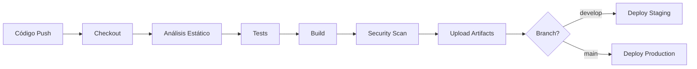

# OWASP Note - CI/CD Pipeline Documentation

Este documento describe la configuración completa del pipeline CI/CD para el proyecto OWASP Note, incluyendo Jenkins, SonarQube y JFrog Artifactory.

## 📋 Tabla de Contenidos

1. [Arquitectura CI/CD](#arquitectura-cicd)
2. [Requisitos Previos](#requisitos-previos)
3. [Instalación y Configuración](#instalación-y-configuración)
4. [Configuración de Jenkins](#configuración-de-jenkins)
5. [Configuración de SonarQube](#configuración-de-sonarqube)
6. [Configuración de JFrog Artifactory](#configuración-de-jfrog-artifactory)
7. [Pipeline de CI/CD](#pipeline-de-cicd)
8. [Seguridad](#seguridad)
9. [Mejores Prácticas](#mejores-prácticas)
10. [Troubleshooting](#troubleshooting)

## 🏗️ Arquitectura CI/CD

```
┌─────────────────┐     ┌─────────────────┐     ┌─────────────────┐
│                 │     │                 │     │                 │
│   Source Code   │────▶│     Jenkins     │────▶│   Artifactory   │
│    (GitHub)     │     │   (CI Server)   │     │  (Artifacts)    │
│                 │     │                 │     │                 │
└─────────────────┘     └────────┬────────┘     └─────────────────┘
                                 │
                                 │
                        ┌────────▼────────┐
                        │                 │
                        │   SonarQube     │
                        │ (Code Quality)  │
                        │                 │
                        └─────────────────┘
```

### Componentes Principales:

- **Jenkins**: Servidor de CI/CD para automatización
- **SonarQube**: Análisis de calidad y seguridad del código
- **JFrog Artifactory**: Gestión de artefactos
- **Docker**: Contenedores para el entorno de build
- **Flutter**: Framework de desarrollo

## 📚 Requisitos Previos

### Hardware Mínimo:
- CPU: 4 cores
- RAM: 8GB (16GB recomendado)
- Disco: 50GB libres

### Software Requerido:
- Docker v20.10+
- Docker Compose v2.0+
- Git
- Certificado SSL (para producción)

### Puertos Necesarios:
- 80/443: Nginx (reverse proxy)
- 8080: Jenkins
- 9000: SonarQube
- 8081: JFrog Artifactory

## 🚀 Instalación y Configuración

### 1. Clonar el Repositorio

```bash
git clone https://github.com/carlos-developer/owaspnote.git
cd owaspnote
```

### 2. Generar Certificados SSL (Desarrollo)

```bash
mkdir -p ci/ssl
cd ci/ssl

# Generar certificado autofirmado para desarrollo
openssl req -x509 -nodes -days 365 -newkey rsa:2048 \
  -keyout key.pem -out cert.pem \
  -subj "/C=US/ST=State/L=City/O=Organization/CN=localhost"

cd ../..
```

### 3. Iniciar el Stack CI/CD

```bash
cd ci
docker-compose up -d

# Verificar que todos los servicios estén corriendo
docker-compose ps

# Ver logs
docker-compose logs -f
```

### 4. Acceder a los Servicios

Una vez iniciados, los servicios estarán disponibles en:

- Jenkins: https://localhost/jenkins/
- SonarQube: https://localhost/sonarqube/
- Artifactory: https://localhost/artifactory/

## 🔧 Configuración de Jenkins

### 1. Configuración Inicial

1. Obtener la contraseña inicial:
```bash
docker exec owaspnote-jenkins cat /var/jenkins_home/secrets/initialAdminPassword
```

2. Acceder a https://localhost/jenkins/ y usar la contraseña

3. Instalar plugins sugeridos + adicionales:
   - Pipeline
   - Git
   - Docker Pipeline
   - SonarQube Scanner
   - JFrog
   - Blue Ocean (opcional)

### 2. Configurar Credenciales

En Jenkins → Manage Jenkins → Manage Credentials:

```
# Credenciales Git
ID: github-credentials
Type: Username with password
Username: tu-usuario-github
Password: tu-token-github

# Credenciales Artifactory
ID: artifactory-url
Type: Secret text
Secret: http://artifactory:8082

ID: artifactory-user
Type: Secret text
Secret: admin

ID: artifactory-password
Type: Secret text
Secret: password

# Credenciales SonarQube
ID: sonarqube-url
Type: Secret text
Secret: http://sonarqube:9000

ID: sonarqube-token
Type: Secret text
Secret: [token generado en SonarQube]

# Android Keystore (para releases)
ID: android-keystore-file
Type: Secret file
File: upload your keystore.jks

ID: android-keystore-password
Type: Secret text
Secret: your-keystore-password

ID: android-key-alias
Type: Secret text
Secret: your-key-alias

ID: android-key-password
Type: Secret text
Secret: your-key-password
```

### 3. Crear el Pipeline

1. New Item → Pipeline → "owaspnote-pipeline"
2. Pipeline → Definition: Pipeline script from SCM
3. SCM: Git
4. Repository URL: https://github.com/carlos-developer/owaspnote.git
5. Credentials: github-credentials
6. Branch: */main
7. Script Path: Jenkinsfile

### 4. Configurar Webhook (GitHub)

En tu repositorio de GitHub:
1. Settings → Webhooks → Add webhook
2. Payload URL: https://your-jenkins-url/jenkins/github-webhook/
3. Content type: application/json
4. Events: Push, Pull Request

## 🔍 Configuración de SonarQube

### 1. Configuración Inicial

1. Acceder a https://localhost/sonarqube/
2. Login por defecto: admin/admin
3. Cambiar contraseña

### 2. Crear Proyecto

```bash
# En SonarQube UI:
1. Create Project → Manually
2. Project key: owaspnote
3. Display name: OWASP Note
4. Generate Token → Save token para Jenkins
```

### 3. Configurar Quality Gates

1. Quality Gates → Create
2. Nombre: "OWASP Security Gate"
3. Condiciones:
   - Security Rating is worse than A
   - Coverage is less than 80%
   - Duplicated Lines is greater than 3%
   - Maintainability Rating is worse than A

### 4. Instalar Plugins

Administration → Marketplace:
- Flutter/Dart plugin
- OWASP plugin
- Security rules

## 📦 Configuración de JFrog Artifactory

### 1. Configuración Inicial

1. Acceder a https://localhost/artifactory/
2. Login por defecto: admin/password
3. Welcome wizard → Skip

### 2. Crear Repositorios

```bash
# Crear repositorio local
1. Administration → Repositories → Local
2. New → Generic
3. Repository Key: owaspnote-artifacts
4. Click "Create"

# Estructura de directorios:
owaspnote-artifacts/
├── android/
│   └── 1.0.0/
│       ├── owaspnote-1.0.0-1.apk
│       └── owaspnote-1.0.0-1.aab
├── web/
│   └── 1.0.0/
│       └── owaspnote-web-1.0.0-1.tar.gz
└── metadata/
    └── 1.0.0/
        └── build-1.json
```

### 3. Configurar Permisos

1. Administration → Security → Permissions
2. New → "CI Users"
3. Repositories: owaspnote-artifacts (Read, Deploy/Cache)
4. Users: Crear usuario "jenkins-ci"

## 🔄 Pipeline de CI/CD

### Flujo del Pipeline



### Etapas del Pipeline

1. **Checkout**: Clona el código fuente
2. **Environment Setup**: Configura Flutter y dependencias
3. **Code Quality**: Análisis estático y formato
4. **Testing**: Unit, Widget e Integration tests
5. **Security Scan**: Búsqueda de vulnerabilidades
6. **Build**: Compilación para Android y Web
7. **Upload**: Subida a Artifactory
8. **Deploy**: Despliegue según rama

### Ejecutar el Pipeline

```bash
# Manualmente desde Jenkins
Build Now → Ver progreso en Blue Ocean o Console Output

# Automáticamente con push a GitHub
git push origin main
```

## 🔐 Seguridad

### 1. Secrets Management

- Nunca hardcodear credenciales
- Usar Jenkins Credentials Store
- Rotar tokens regularmente
- Usar variables de entorno

### 2. Seguridad en Build

```groovy
// En Jenkinsfile
pipeline {
    options {
        // Timeout para evitar builds colgados
        timeout(time: 60, unit: 'MINUTES')
        
        // No ejecutar builds concurrentes
        disableConcurrentBuilds()
        
        // Limpiar workspace
        skipDefaultCheckout()
    }
}
```

### 3. Análisis de Seguridad

El pipeline incluye:
- SAST con SonarQube
- Dependency scanning
- Secret detection
- OWASP compliance checks

### 4. Configuración de Red

```yaml
# docker-compose.yml seguro
services:
  jenkins:
    # No exponer puertos directamente
    expose:
      - "8080"
    # Usar red interna
    networks:
      - internal
```

## 📋 Mejores Prácticas

### 1. Branching Strategy

```
main (producción)
  └── develop (desarrollo)
       ├── feature/nueva-funcionalidad
       ├── bugfix/correccion-error
       └── hotfix/parche-urgente
```

### 2. Versionado Semántico

```
MAJOR.MINOR.PATCH-BUILD
1.2.3-456

MAJOR: Cambios incompatibles
MINOR: Nueva funcionalidad compatible
PATCH: Correcciones de bugs
BUILD: Número de build de Jenkins
```

### 3. Quality Gates

- Coverage mínimo: 80%
- Sin vulnerabilidades críticas
- Sin code smells bloqueantes
- Todos los tests pasando

### 4. Monitoreo

```bash
# Logs de Jenkins
docker logs -f owaspnote-jenkins

# Métricas de sistema
docker stats

# Health checks
curl https://localhost/health
```

## 🔧 Troubleshooting

### Problema: Jenkins no puede conectar con Docker

```bash
# Solución: Agregar permisos
docker exec -u root owaspnote-jenkins \
  usermod -aG docker jenkins

# Reiniciar contenedor
docker-compose restart jenkins
```

### Problema: SonarQube no inicia

```bash
# Verificar logs
docker logs owaspnote-sonarqube

# Posible solución: aumentar límites
sudo sysctl -w vm.max_map_count=262144
```

### Problema: Build de Flutter falla

```bash
# Limpiar caché
docker exec owaspnote-flutter-ci \
  flutter clean

# Actualizar dependencias
docker exec owaspnote-flutter-ci \
  flutter pub get
```

### Problema: Artifactory sin espacio

```bash
# Limpiar artefactos antiguos
docker exec owaspnote-artifactory \
  find /var/opt/jfrog/artifactory/data/filestore \
  -mtime +30 -delete
```

## 📊 Métricas y KPIs

### Métricas de CI/CD

- **Lead Time**: Tiempo desde commit hasta producción
- **Deployment Frequency**: Despliegues por día
- **MTTR**: Tiempo medio de recuperación
- **Change Failure Rate**: % de despliegues fallidos

### Dashboard de Monitoreo

```groovy
// Agregar al Jenkinsfile
post {
    always {
        // Publicar métricas
        publishHTML([
            allowMissing: false,
            alwaysLinkToLastBuild: true,
            keepAll: true,
            reportDir: 'build/reports',
            reportFiles: 'index.html',
            reportName: 'Build Report'
        ])
    }
}
```

## 🚨 Comandos Útiles

### Gestión de Contenedores

```bash
# Iniciar servicios
cd ci && docker-compose up -d

# Detener servicios
docker-compose down

# Reiniciar servicio específico
docker-compose restart jenkins

# Ver logs en tiempo real
docker-compose logs -f sonarqube

# Limpiar todo (¡CUIDADO!)
docker-compose down -v
```

### Backup y Restore

```bash
# Backup Jenkins
docker exec owaspnote-jenkins \
  tar -czf /tmp/jenkins-backup.tar.gz \
  /var/jenkins_home

# Backup Artifactory
docker exec owaspnote-artifactory \
  tar -czf /tmp/artifactory-backup.tar.gz \
  /var/opt/jfrog/artifactory

# Restore
docker cp backup.tar.gz container:/tmp/
docker exec container tar -xzf /tmp/backup.tar.gz -C /
```

## 📞 Soporte

Para problemas o preguntas:

1. Revisar logs: `docker-compose logs [servicio]`
2. Consultar documentación oficial de cada herramienta
3. Abrir issue en el repositorio
4. Contactar al equipo de DevOps

---

**Última actualización**: $(date)
**Versión**: 1.0.0
**Autor**: OWASP Note Team